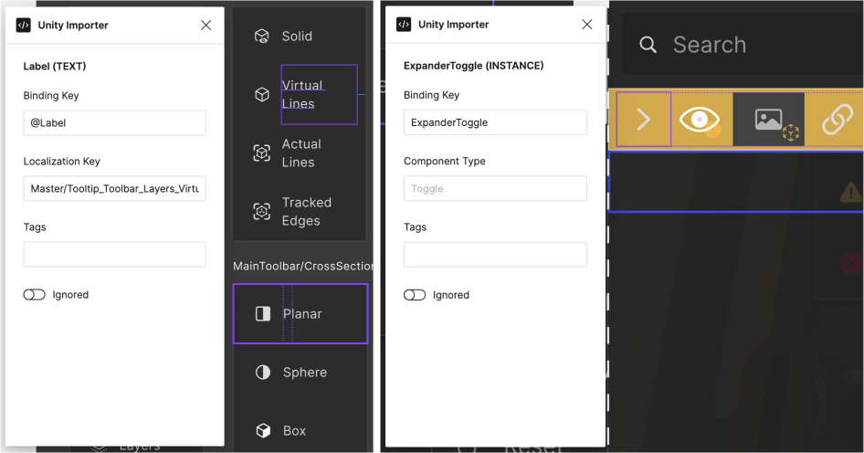

# Unity Figma Importer Plugin
The Unity Figma importer plugin is designed to facilitate the process of saving Unity-specific data directly onto Figma nodes. This data can then be utilized during the import process into Unity, streamlining the workflow between design and development teams. This plugin runs on Figma app.

**You also need to use [Unity Figma Importer](https://github.com/cdmvision/unity-figma-importer.git) package to import your Figma design into Unity.**

### Installation from Figma Community
* Open Figma.
* Navigate to the `Plugins` menu.
* Click on `Manage Plugins`.
* Search for `Unity Figma Importer` in the search bar.
* Click on `Run` to add the plugin to your Figma workspace.

### How to build for development
* Go to project directory and run:
* `npm install`
* `npm run build`
* Open Figma desktop app and select `Plugins > New > Import plugin from manifest...`
* Select the plugin `manifest.json` and done!

### License
This plugin is licensed under the [MIT License](LICENSE).

